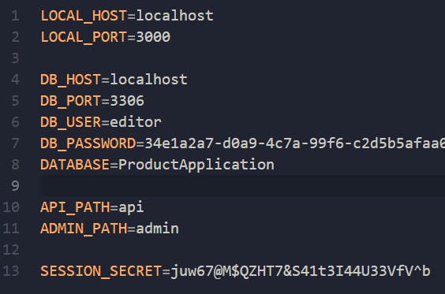

# Shop

My first fullstack project with Express.js (Backend) + React.js (Frontend)

# To start (Required Node.js)

1. Create .env file and enter your data \
   For example: \
   
2. Enter your url to file
   [clientURL](./Shop.Client/ReactApp/src/const.ts)
3. Install all dependencies
   ```
   npm install
   ```
4. Move to `Shop.Client/ReactApp` and run
   ```
   npm run build
   ```
5. Return to root directory and run

   ```
      nodemon
   ```
